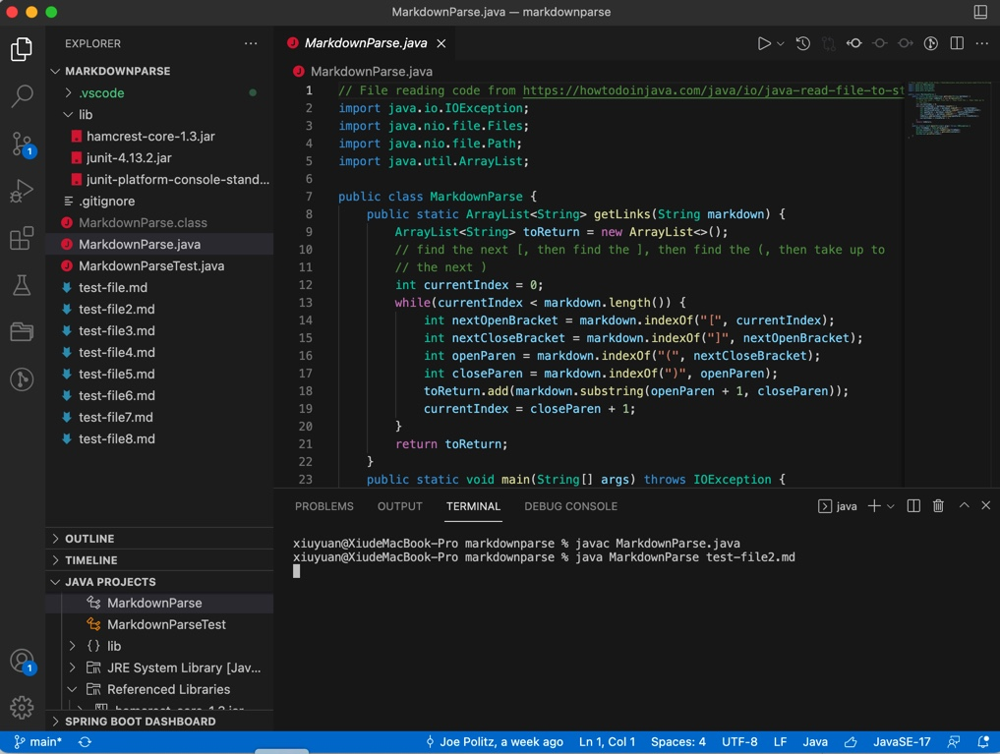
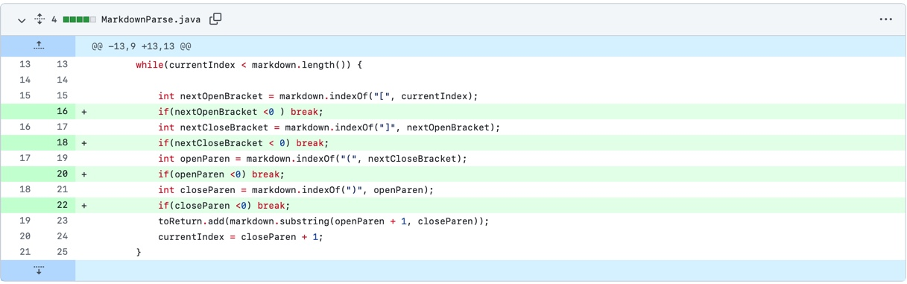
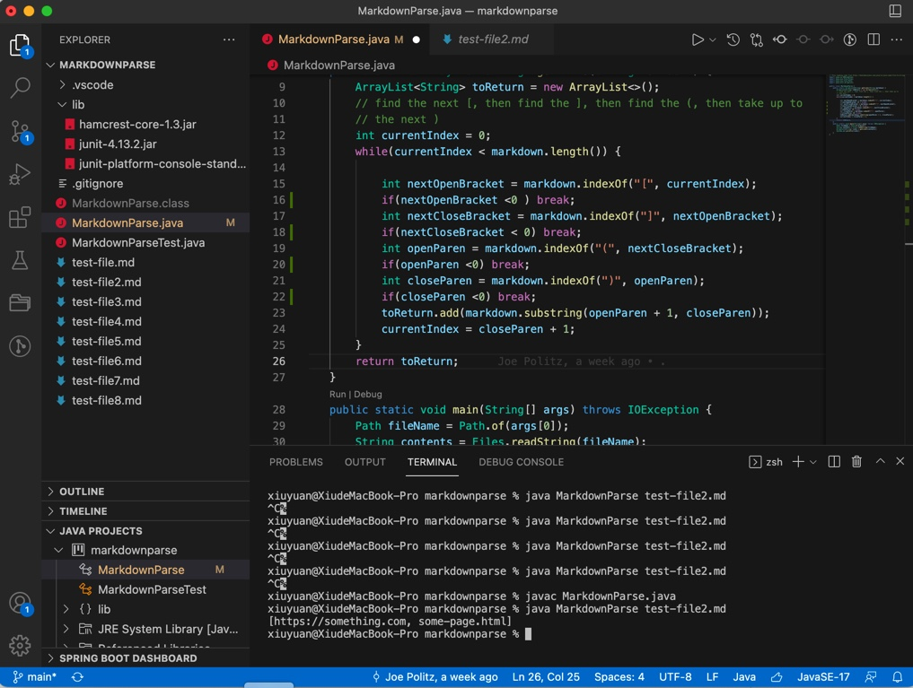
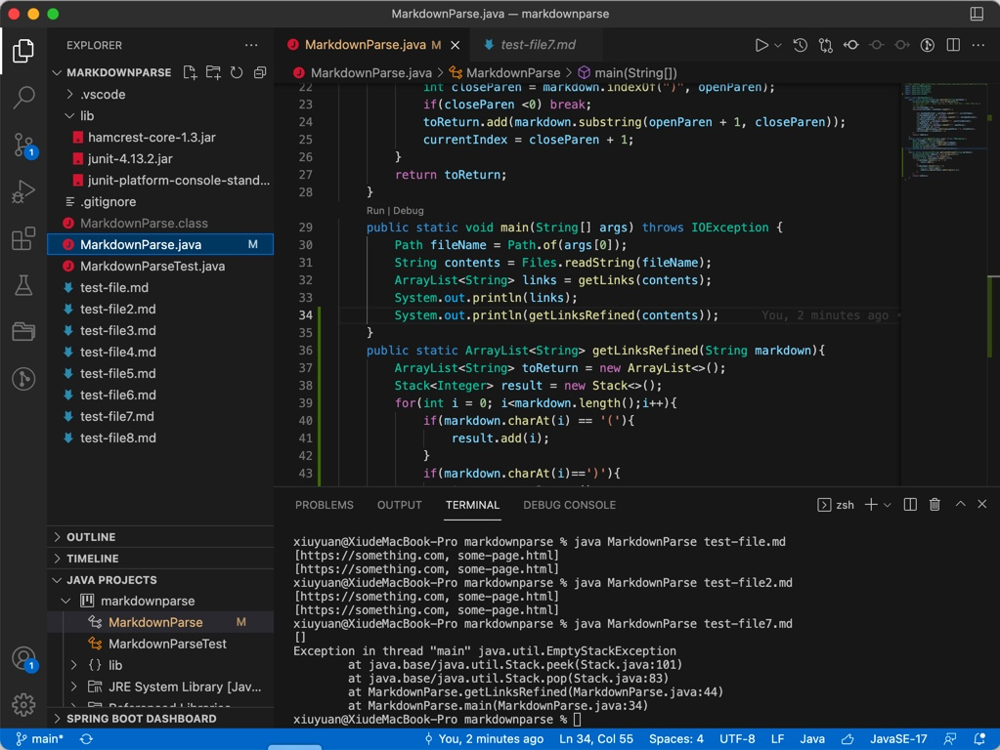
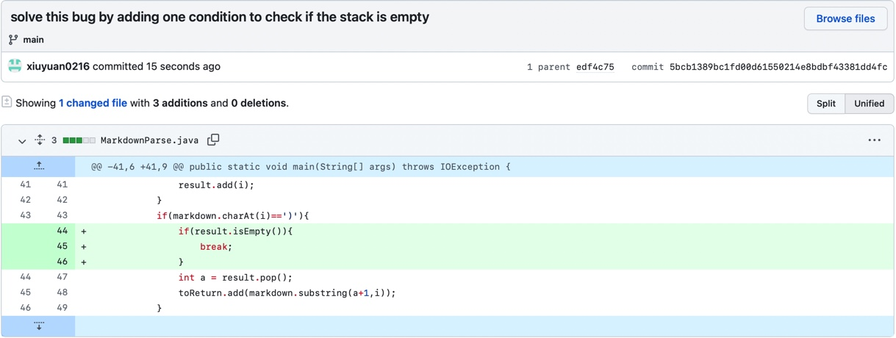
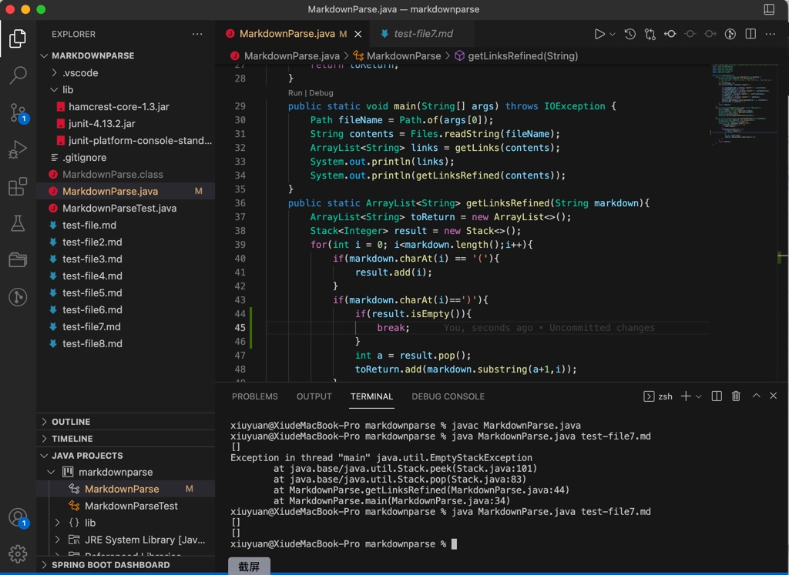
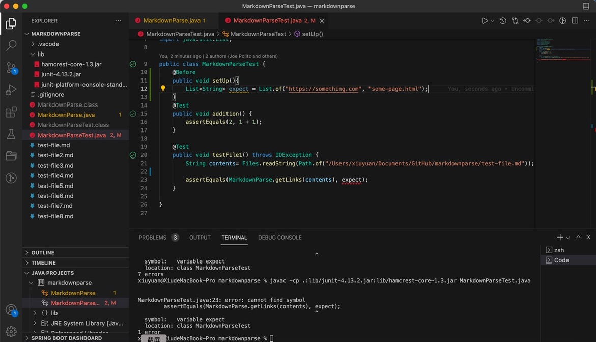
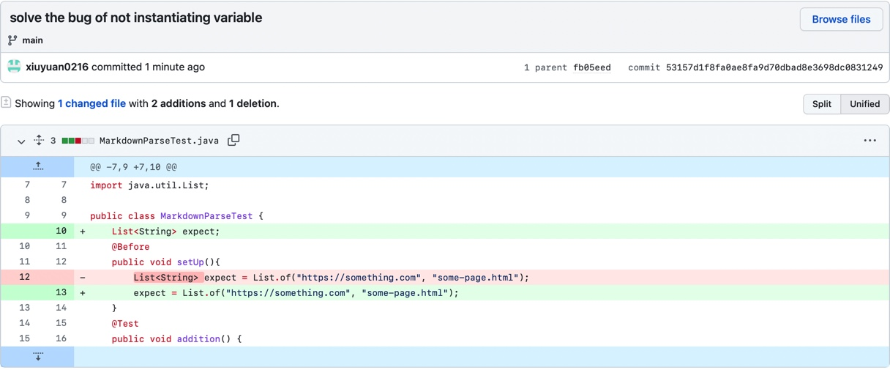
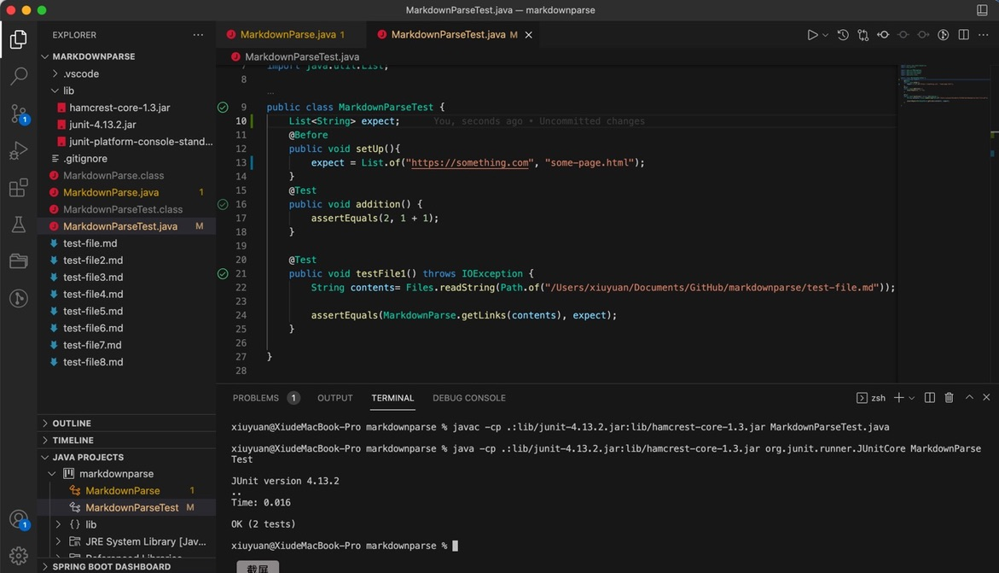

# Lab Report 2: Code Changes to Solve Bugs
# 1. Solving the Problem of Infinite Loop

>The following is the screenshot for the failure: 

>Apparently, the program goes into infinite loop. Here is the [link](test-file2.md) for the test file that causes this problem. The reason why the infinite loop occurs is that there are some other characters after the parentheses. Therefore, currentIndex will be always smaller than markdown.length(), and the while condition always holds. The following is the screenshot of the code change to solve this bug and the correct output. 

>Four extra conditions that check whether nextOpenBracket, nextCloseBracket, openParen, and closeParen are smaller than zero are added to solve the infinite loop. This works because when all brackets and parentheses are already dealt with, the result of indexOf() will be -1. With these if statements, the while loop will break. The output of our revised program indicates the correctness of our code change. 

 

# 2. Solving the Problem of EmptyStackException

>During the lab, we try to use the data structure of stack to do markdown parse. The following is the original code that causes EmptyStackException.

>Here is the [link](test-file7.md) for the test file that causes EmptyStackException. The reason why this problem occurs is that we didn't check whether the stack is empty. Calling pop() method when the stack is already empty causes this EmptytackException. The following pictures are the code changes and output of our refined program. 

 

 

>By adding an extra if statement, we exclude the possibility of EmptyStackException, as when the stack is empty, it breaks the for loop. 

# 3. Solving the Problem of Not Instantiating Varaible

>During the lab, to deal with many test methods, we try to use @Before and setUp() method to instantiate all the variables. However, cannot find symbol occurs when we use command line to run the test program. 

 

>The error occurs because we put the instantiation of variables inside the @Before method. Actually, @Before annotation only functions in runtime, so the Java static checker can't find the variables and gives cannot find symbol error. The following pictures are code changes and correct output. 

>We solve this bug by putting the variable as class field and instantiate in @Before method. Here is the [link](MarkdownParseTest.java) for revised test file. 
